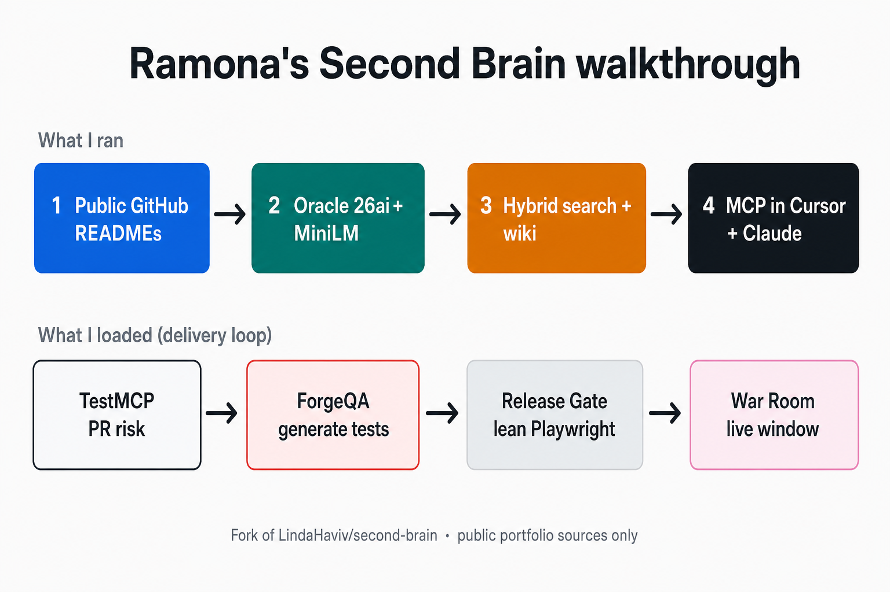

# What I built with Second Brain

Hi — I'm [Ramona](https://github.com/ramonacraft). This wiki is a **public case study** of my fork of Linda Haviv's [second-brain](https://github.com/LindaHaviv/second-brain).

I ran the local stack end to end, pointed it at my **public** QA / delivery portfolio (not private notes), searched it from **Cursor over MCP**, asked Claude research questions grounded in my READMEs, and compiled the in-database **wiki** into synthesized topic pages.

**Upstream credit:** everything here stands on Linda's architecture — Oracle AI Database 26ai, in-DB embeddings, privacy filters, agent memory, and MCP. Thank you, Linda.

## How the flow works

| Step | What it is |
|------|------------|
| **1 · Public GitHub READMEs** | Profile + War Room, Release Gate, ForgeQA, TestMCP |
| **2 · Oracle 26ai + MiniLM** | Local Colima container, in-DB embeddings |
| **3 · Hybrid search + wiki** | Meaning search, research agent, compiled topic pages |
| **4 · MCP in Cursor + Claude** | Same brain reachable from the tools I actually use |

## Start here

| Page | What's on it |
|------|----------------|
| [What I loaded](What-I-Loaded.md) | Public sources only (profile + 4 project READMEs) |
| [Architecture I ran](Architecture-I-Ran.md) | Colima → Oracle → embeddings → MCP → Cursor / Claude |
| [Delivery-loop brain](Delivery-Loop-Brain.md) | How search + research answered *my* questions |
| [Compiled wiki](Compiled-Wiki.md) | Lab 5 topic pages with citations |
| [Try it / credits](Try-It-and-Credits.md) | How to follow along + thanks |

## One-line result

> Ramona ran second-brain locally, loaded her public QA portfolio, searched it from Cursor over MCP, compiled a wiki of her delivery loop, and documented it here — with credit to Linda.
